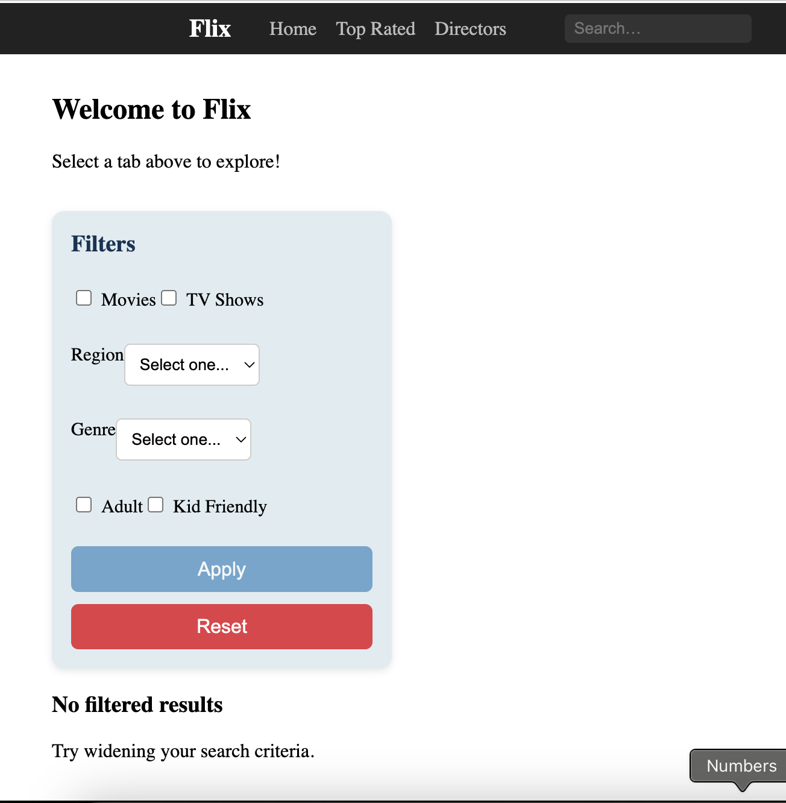
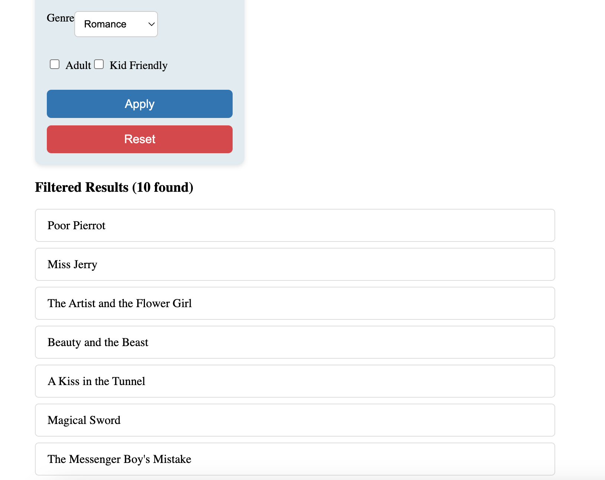
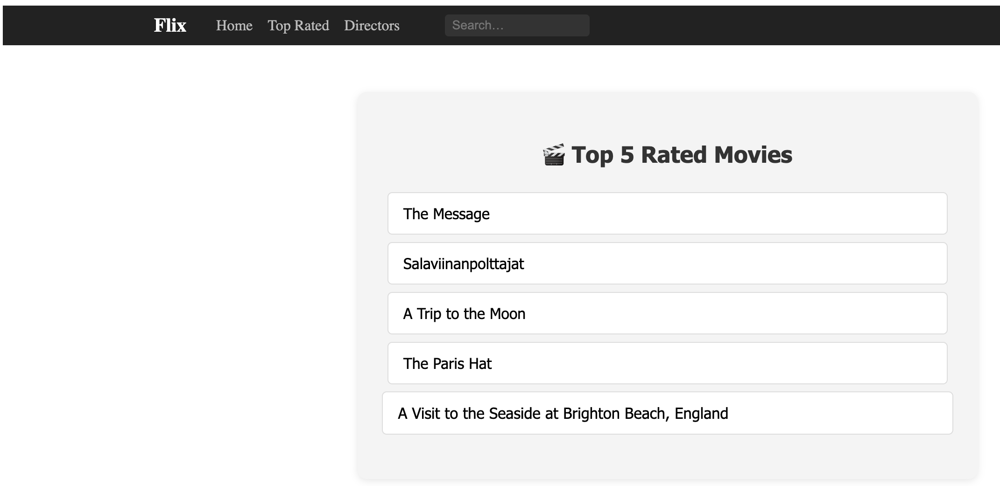
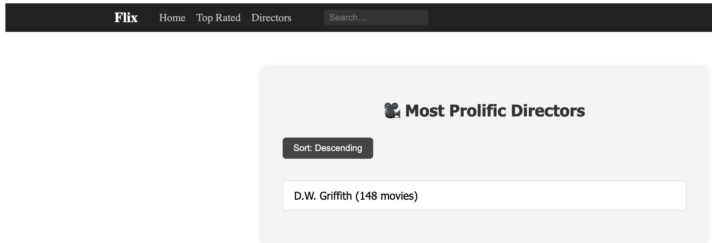

# Flix

Team Members: Iman Ahsan (iahsan@uwaterloo.ca), Iman Khan (i75khan@uwaterloo.ca), Adnan Habib (a38habib@uwaterloo.ca), Arvind Sivaram (a22sivar@uwaterloo.ca)

Production dataset: https://datasets.imdbws.com/

Tech Stack: Javascript/React for the frontend, Python in the backend, MySQL for the database

# Install python dependencies

Run `pip install -r requirements.txt` to install them

# Set up DB on Mac

cd in the Flix directory in your terminal. Enter:

```/path/to/bin/mysql -u root -p```

```/usr/local/mysql/bin/mysql -u root -p```  
```/opt/homebrew/bin/mysql -u root -p```   

Then in the MySQL shell enter: ```SOURCE init_db.sql;``` to initialize production tables  
Then in the MySQL shell enter: ```SOURCE init_sample_db.sql;``` to initialize sample tables

# Set up DB on Windows

```cd "C:\Program Files\MySQL\MySQL Server 9.3\bin"```

```.\mysql -u root -p```

# Exploring MySQL:

In the shell you can enter the following commands: 

To list all databases ```SHOW DATABASES;```

To select the database to use ```USE database_name;```

To list all tables in the selected database ```SHOW TABLES;```

To view the structure of a table ```DESCRIBE table_name;```

To see data from a table ```SELECT * FROM table_name;```

# Populate tables

Download the following `.tsv` files from [IMDb Non-Commercial Datasets](https://developer.imdb.com/non-commercial-datasets/):

- title.basics.tsv.gz
- name.basics.tsv.gz
- title.crew.tsv.gz
- title.ratings.tsv.gz
- title.principals.tsv.gz
- title.akas.tsv.gz
- title.episode.tsv.gz

Run `python3 populate_db.py` to populate the production db. 
Run `python3 populate_sample_db.py` to populate the sample db

# Application:

To run the backend: `python3 flix.py`  
To run the frontend cd in the folder ```/frontend``` and run: `npm install` and then `npm start`. 

# Testing SQL queries

```/path/to/bin/mysql -u root -p --table sample_flix < test-sample.sql > test-sample.out```

# If Need To Remake Sample DB  
Drop tables in this order before creation:

DROP TABLE IF EXISTS titlePrincipals;  
DROP TABLE IF EXISTS titleRatings;  
DROP TABLE IF EXISTS titleCrew;  
DROP TABLE IF EXISTS titleAkas;  
DROP TABLE IF EXISTS titleEpisode;  
DROP TABLE IF EXISTS nameBasics;  
DROP TABLE IF EXISTS titleBasics;

# Web App Image Showcase






